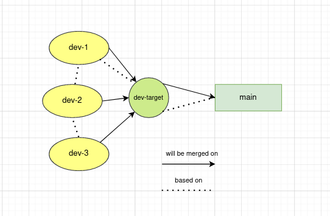

# git ladder merge

um script shell responsável por mesclar N branches filhas.

## por que?

no meu trabalho atual, muitas vezes sentimos necessidade de criar N branches do git, buscando separar melhor o intuito de cada parte do desenvolvimento para o reviewer em questão. Nossas branches acabam se estruturando em:

  

ou seja, a branch alvo (final) é criada com base na main, se tornando uma espécie de cópia da mesma. A primeira branch de desenvolvimento (que conterá as alterações referentes à primeira etapa do desenvolvimento), é criada com base na branch alvo, e nela será mesclada. A segunda branch, será criada com base na primeira, porém também será mesclada na branch alvo, e assim por diante, sendo a 3 criada a partir da 2, a 4 da 3 e etc.

### _o problema_

seguindo o fluxo explicado, chegamos a um possível problema de que, caso exista uma alteração na primeira branch, o ideal é que seja feita a mesclagem de todas as outras N branches, apontando pra anterior, o que acaba por ser trabalhoso e cansativo. Se eu tiver 10 branches, terei que executar: 

  ```
    git checkout branch-2
    git merge branch-1

    git checkout branch-3
    git merge branch-2

    git checkouMEU DEUS NAO AGUENTO MAIS
  ```

buscando facilitar nosso trabalho perante esse problema, desenvolvi esse script para automatizar esse processo de mesclagem.

## como posso utilizar esse script?

clone o repositório em uma pasta desejada

``` 
  git clone git@github.com:joaomarcelogomes/git-ladder-merge.git
```

mude o script para o seu espaço de trabalho. (adicione o mesmo ao seu gitignore, de preferência)

```
  mv git-ladder-merge.sh my-workplace
```

por fim, execute o script, passando como parâmetro, respectivamente, o nome base da branch, o número de branches de desenvolvimento, o nome da branch alvo, e a palavra de separação das branches

exemplo: eu possuo 3 branches, desconsiderando a alvo, elas se chamam:

    joao-adiciona-numeros-parte1
    joao-adiciona-numeros-parte2
    joao-adiciona-numeros-parte3

e possuo a branch alvo, que se chama:

    joao-adiciona-numeros-alvo

assim, posso quebrar a nomenclatura de minhas branches em:

    nome base das minhas branches: joao-adiciona-numeros
    numero de branches: 3
    nome da branch alvo (tirando o nome base): alvo
    palavra de separação de partes: parte

logo, a minha execução se dará como:
```
  bash merge-ladder.sh joao-adiciona-numeros 3 alvo parte
```

